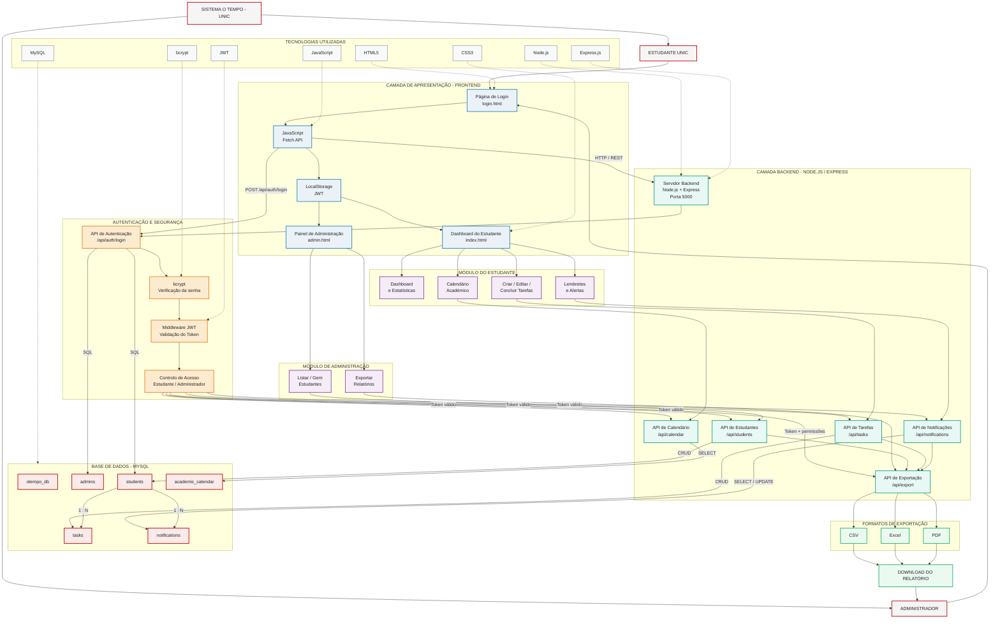

# Arquitetura do Sistema O Tempo
# Arquitetura do Sistema "O Tempo" - UNIC

```mermaid
flowchart TD

    %% =====================================================
    %% SISTEMA
    %% =====================================================

    SISTEMA["SISTEMA O TEMPO - UNIC"]

    %% =====================================================
    %% UTILIZADORES
    %% =====================================================

    ESTUDANTE["ESTUDANTE UNIC"]
    ADMIN["ADMINISTRADOR"]

    SISTEMA --> ESTUDANTE
    SISTEMA --> ADMIN


    %% =====================================================
    %% FRONTEND
    %% =====================================================

    subgraph FRONTEND["CAMADA DE APRESENTAÇÃO - FRONTEND"]

        LOGIN["Página de Login<br>login.html"]

        DASHBOARD["Dashboard do Estudante<br>index.html"]

        PAINEL_ADMIN["Painel de Administração<br>admin.html"]

        JAVASCRIPT["JavaScript<br>Fetch API"]

        LOCALSTORAGE["LocalStorage<br>JWT"]

    end


    ESTUDANTE --> LOGIN
    ADMIN --> LOGIN

    LOGIN --> JAVASCRIPT
    JAVASCRIPT --> LOCALSTORAGE

    LOCALSTORAGE --> DASHBOARD
    LOCALSTORAGE --> PAINEL_ADMIN


    %% =====================================================
    %% AUTENTICAÇÃO
    %% =====================================================

    subgraph SEGURANCA["AUTENTICAÇÃO E SEGURANÇA"]

        AUTH["API de Autenticação<br>/api/auth/login"]

        BCRYPT["bcrypt<br>Verificação da senha"]

        JWT["Middleware JWT<br>Validação do Token"]

        ROLE["Controlo de Acesso<br>Estudante / Administrador"]

    end


    JAVASCRIPT -->|"POST /api/auth/login"| AUTH

    AUTH --> BCRYPT
    BCRYPT --> JWT
    JWT --> ROLE


    %% =====================================================
    %% BACKEND
    %% =====================================================

    subgraph BACKEND["CAMADA BACKEND - NODE.JS / EXPRESS"]

        SERVER["Servidor Backend<br>Node.js + Express<br>Porta 5000"]

        API_TASKS["API de Tarefas<br>/api/tasks"]

        API_STUDENTS["API de Estudantes<br>/api/students"]

        API_NOTIFICATIONS["API de Notificações<br>/api/notifications"]

        API_CALENDAR["API de Calendário<br>/api/calendar"]

        API_EXPORT["API de Exportação<br>/api/export"]

    end


    JAVASCRIPT -->|"HTTP / REST"| SERVER

    SERVER --> AUTH

    ROLE -->|"Token válido"| API_TASKS
    ROLE -->|"Token válido"| API_STUDENTS
    ROLE -->|"Token válido"| API_NOTIFICATIONS
    ROLE -->|"Token válido"| API_CALENDAR
    ROLE -->|"Token + permissões"| API_EXPORT


    %% =====================================================
    %% FUNCIONALIDADES DO ESTUDANTE
    %% =====================================================

    subgraph MODULO_ESTUDANTE["MÓDULO DO ESTUDANTE"]

        DASH["Dashboard<br>e Estatísticas"]

        TAREFAS["Criar / Editar /<br>Concluir Tarefas"]

        CALENDARIO["Calendário<br>Académico"]

        NOTIFICACOES["Lembretes<br>e Alertas"]

    end


    DASHBOARD --> DASH
    DASHBOARD --> TAREFAS
    DASHBOARD --> CALENDARIO
    DASHBOARD --> NOTIFICACOES

    TAREFAS --> API_TASKS
    CALENDARIO --> API_CALENDAR
    NOTIFICACOES --> API_NOTIFICATIONS


    %% =====================================================
    %% ADMINISTRAÇÃO
    %% =====================================================

    subgraph MODULO_ADMIN["MÓDULO DE ADMINISTRAÇÃO"]

        GERIR_ESTUDANTES["Listar / Gerir<br>Estudantes"]

        RELATORIOS["Exportar<br>Relatórios"]

    end


    PAINEL_ADMIN --> GERIR_ESTUDANTES
    PAINEL_ADMIN --> RELATORIOS

    GERIR_ESTUDANTES --> API_STUDENTS
    RELATORIOS --> API_EXPORT


    %% =====================================================
    %% BASE DE DADOS
    %% =====================================================

    subgraph MYSQL["BASE DE DADOS - MYSQL"]

        DB["otempo_db"]

        ADMINS["admins"]

        STUDENTS["students"]

        TASKS["tasks"]

        NOTIFICATIONS["notifications"]

        ACADEMIC["academic_calendar"]

    end


    %% =====================================================
    %% AUTENTICAÇÃO -> BD
    %% =====================================================

    AUTH -->|"SQL"| ADMINS
    AUTH -->|"SQL"| STUDENTS


    %% =====================================================
    %% APIs -> BD
    %% =====================================================

    API_TASKS -->|"CRUD"| TASKS

    API_STUDENTS -->|"CRUD"| STUDENTS

    API_NOTIFICATIONS -->|"SELECT / UPDATE"| NOTIFICATIONS

    API_CALENDAR -->|"SELECT"| ACADEMIC


    %% =====================================================
    %% RELACIONAMENTOS
    %% =====================================================

    STUDENTS -->|"1 : N"| TASKS

    STUDENTS -->|"1 : N"| NOTIFICATIONS


    %% =====================================================
    %% EXPORTAÇÃO
    %% =====================================================

    API_STUDENTS --> API_EXPORT
    API_TASKS --> API_EXPORT
    API_NOTIFICATIONS --> API_EXPORT


    subgraph FORMATOS["FORMATOS DE EXPORTAÇÃO"]

        CSV["CSV"]

        EXCEL["Excel"]

        PDF["PDF"]

    end


    API_EXPORT --> CSV
    API_EXPORT --> EXCEL
    API_EXPORT --> PDF

    CSV --> DOWNLOAD["DOWNLOAD DO RELATÓRIO"]
    EXCEL --> DOWNLOAD
    PDF --> DOWNLOAD

    DOWNLOAD --> ADMIN


    %% =====================================================
    %% TECNOLOGIAS
    %% =====================================================

    subgraph TECNOLOGIAS["TECNOLOGIAS UTILIZADAS"]

        HTML["HTML5"]

        CSS["CSS3"]

        JS["JavaScript"]

        NODE["Node.js"]

        EXPRESS["Express.js"]

        MYSQL_TECH["MySQL"]

        JWT_TECH["JWT"]

        BCRYPT_TECH["bcrypt"]

    end


    HTML -.-> LOGIN
    CSS -.-> DASHBOARD
    JS -.-> JAVASCRIPT

    NODE -.-> SERVER
    EXPRESS -.-> SERVER

    MYSQL_TECH -.-> MYSQL
    JWT_TECH -.-> JWT
    BCRYPT_TECH -.-> BCRYPT


    %% =====================================================
    %% ESTILIZAÇÃO
    %% =====================================================

    classDef utilizador fill:#f5f5f5,stroke:#C00000,stroke-width:2px,color:#222;

    classDef frontend fill:#eaf2f8,stroke:#2980b9,stroke-width:2px,color:#222;

    classDef seguranca fill:#fdebd0,stroke:#e67e22,stroke-width:2px,color:#222;

    classDef backend fill:#e8f8f5,stroke:#16a085,stroke-width:2px,color:#222;

    classDef modulo fill:#f4ecf7,stroke:#8e44ad,stroke-width:2px,color:#222;

    classDef database fill:#f9ebea,stroke:#C00000,stroke-width:2px,color:#222;

    classDef exportacao fill:#eafaf1,stroke:#27ae60,stroke-width:2px,color:#222;

    classDef tecnologia fill:#f8f9f9,stroke:#566573,stroke-width:1px,color:#222;


    class ESTUDANTE,ADMIN,SISTEMA utilizador;

    class LOGIN,DASHBOARD,PAINEL_ADMIN,JAVASCRIPT,LOCALSTORAGE frontend;

    class AUTH,BCRYPT,JWT,ROLE seguranca;

    class SERVER,API_TASKS,API_STUDENTS,API_NOTIFICATIONS,API_CALENDAR,API_EXPORT backend;

    class DASH,TAREFAS,CALENDARIO,NOTIFICACOES,GERIR_ESTUDANTES,RELATORIOS modulo;

    class DB,ADMINS,STUDENTS,TASKS,NOTIFICATIONS,ACADEMIC database;

    class CSV,EXCEL,PDF,DOWNLOAD exportacao;

    class HTML,CSS,JS,NODE,EXPRESS,MYSQL_TECH,JWT_TECH,BCRYPT_TECH tecnologia;
```